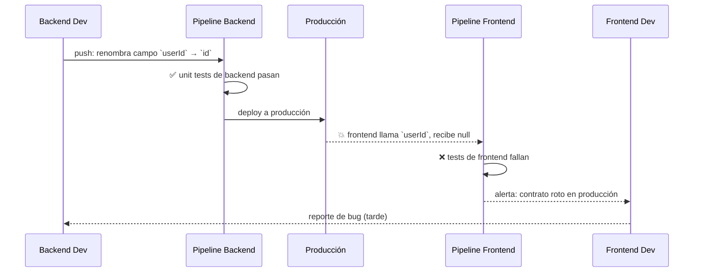
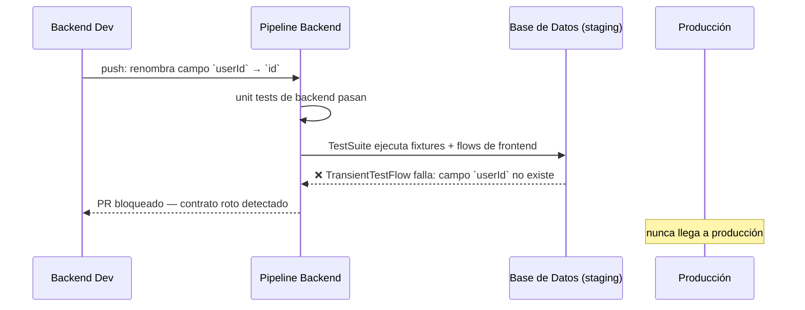

# El Problema

Los equipos de frontend escriben tests con sus propias herramientas (e.g., `package:test`,
patrones Flutter/Dart) para validar los contratos que el backend expone: APIs, modelos de
datos, comportamientos esperados.

El problema es que esos tests hoy solo corren en el pipeline de frontend. El equipo de
backend puede introducir un breaking change — renombrar un campo, cambiar una respuesta,
eliminar un endpoint — y nadie lo detecta hasta que el frontend falla en producción o en
su propio CI, cuando ya es demasiado tarde.

## Sin testeador: el contrato se rompe en silencio



El error se detecta **después del deploy**, cuando el daño ya está hecho.

## Con testeador: detección antes del merge



El error se detecta **en el pipeline de backend**, antes del merge.

La solución es ejecutar esos mismos tests de frontend dentro del pipeline de CI/CD del
backend. `testeador` actúa como puente: permite correr tests escritos con convenciones de
frontend (fixtures tipadas, flujos secuenciales, integración con `dart test`) en el
contexto del backend, con acceso real a la base de datos y con control sobre el estado
de cada flujo (transient vs. lasting).

El resultado es detección temprana: cualquier cambio de backend que rompa un contrato con
el frontend se descubre antes de que el código llegue a producción.

## Por qué los tests deben escribirse con herramientas de frontend

Si el equipo de backend reescribiera los tests de contrato con sus propias herramientas
(e.g., tests HTTP ad-hoc, scripts de validación propios), se generaría un problema de
mantenibilidad crítico: **el mismo contrato estaría descrito dos veces, en dos lenguajes
distintos, mantenidos por dos equipos distintos**.

Cuando el contrato cambia intencionalmente, alguien tiene que actualizar ambas versiones.
Con el tiempo, las dos representaciones divergen, los tests dejan de reflejar la realidad
del frontend, y la red de seguridad se vuelve falsa: los tests pasan, pero el contrato
real sigue roto.

```
❌ Duplicación de responsabilidad

  Repositorio Frontend          Repositorio Backend
  ─────────────────────         ──────────────────────
  test: user.id == "abc"        test: userId == "abc"   ← copia desincronizada
  (mantenido por FE team)       (mantenido por BE team)
        │                               │
        └──── divergen con el tiempo ───┘
```

La única fuente de verdad sobre cómo el frontend consume el backend son **los tests del
frontend**. Ejecutarlos garantiza que lo que se valida en el pipeline de backend es
exactamente lo que el frontend espera, sin intermediarios que puedan quedar desactualizados.

```
✅ Única fuente de verdad

  Repositorio Frontend
  ─────────────────────
  test: user.id == "abc"   ←── escrito y mantenido por FE team
        │
        │  referenciado como dependencia Dart
        ▼
  Pipeline Backend
  ─────────────────────
  dart test  ←── corre exactamente los mismos tests, sin duplicar
```

Además, tener los tests en el ámbito del frontend **obliga al equipo de backend a
comunicar los cambios disruptivos**: si un cambio de backend rompe los tests de frontend
en el pipeline de backend, el equipo de backend sabe que debe coordinar con frontend para
que ambos lados actualicen su código al mismo tiempo — evitando bugs silenciosos y
forzando una comunicación explícita entre equipos ante cualquier cambio de contrato.

`testeador` hace posible este modelo: provee las abstracciones (`Fixture<T>`,
`TransientTestFlow<T>`, `LastingTestFlow<T>`, `TestSuite`) para que los tests de frontend
puedan ejecutarse en el contexto del backend sin modificaciones.

## Eficiencia: el código de producción es la fuente de verdad

Los `TestFlow` de `testeador` no reemplazan los tests del frontend — los **envuelven**.
Un `TransientTestFlow` o `LastingTestFlow` toma los tests regulares del frontend (escritos
sin mocks, contra el contrato real) y los ejecuta dentro de un contexto de backend con
fixtures y control de estado. No se toca ni se adapta el código de test original.

Esto tiene una consecuencia directa en la eficiencia del equipo: **nadie pierde tiempo
escribiendo código que no sea de producción**. No hay adaptadores, no hay wrappers
específicos para el pipeline de backend, no hay versiones alternativas de los tests. El
código de test del frontend corre tal cual, y el código de producción del backend es el
que se pone a prueba.

```
✅ Cero código extra de adaptación

  Test de frontend (sin cambios)
  ──────────────────────────────
  test('GET /users/:id retorna user.id', () async {
    final user = await api.getUser('abc');
    expect(user.id, equals('abc'));       ← test real, sin mocks
  });
        │
        │  envuelto por testeador
        ▼
  TransientTestFlow(
    name: 'Contrato GET /users/:id',
    steps: [fetchUserStep],              ← mismo test, mismo código
  )
        │
        ▼
  Pipeline Backend → dart test → ✅ o ❌
```

La fuente de verdad es el código mismo: el test del frontend define el contrato, el
backend lo cumple o no — sin intermediarios, sin duplicación, sin deuda de mantenimiento.

## Requisitos

- Los tests de frontend deben estar escritos contra un backend real, sin mocks que oculten
  discrepancias de contrato.
- Debe existir un mecanismo para declarar y preparar el estado inicial de la base de datos
  antes de cada flujo de tests (`Fixture<T>`).
- Los tests que no modifican el estado deben revertirse automáticamente al finalizar
  (`TransientTestFlow<T>` con rollback implícito).
- Los tests que sí modifican el estado deben estar claramente identificados y ejecutarse en
  orden controlado (`LastingTestFlow<T>`).
- Los flujos deben poder agruparse y ejecutarse como una suite coherente (`TestSuite`).
- El pipeline de backend debe poder correr los tests con `dart test` sin configuración
  adicional ni dependencias de herramientas de frontend.
- El código de tests debe poder compartirse entre el repositorio de frontend y el de backend,
  idealmente como dependencia de paquete Dart publicada o referenciada por path/git.
- El equipo de backend debe poder agregar la suite de tests de frontend a su pipeline de CI/CD
  sin necesidad de conocer los detalles internos del frontend.