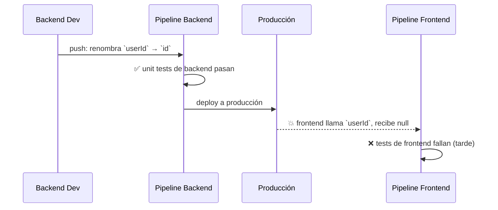
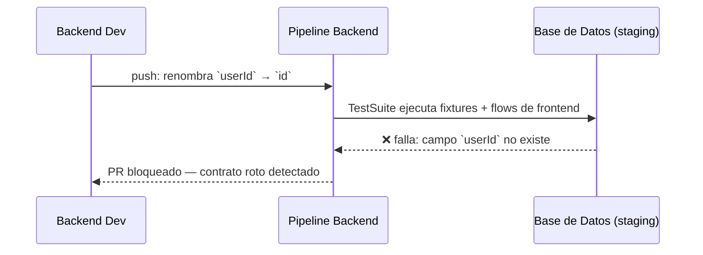

# El Problema

Los equipos de frontend escriben tests con sus propias herramientas (`package:test`, patrones Flutter/Dart) para validar los contratos que el backend expone: APIs, modelos de datos, comportamientos esperados.

Esos tests hoy solo corren en el pipeline de frontend. El backend puede introducir un breaking change —renombrar un campo, cambiar una respuesta, eliminar un endpoint— y nadie lo detecta hasta que el frontend falla en producción o en su propio CI, cuando ya es tarde.

## Sin testeador: el contrato se rompe en silencio



El error se detecta **después del deploy**, cuando el daño ya está hecho.

## Con testeador: detección antes del merge



`testeador` actúa como puente: permite correr los mismos tests de frontend (fixtures tipadas, flujos secuenciales, integración con `dart test`) dentro del pipeline de backend, con acceso real a la base de datos. El error se detecta **antes del merge**, nunca llega a producción.

## Por qué los tests deben escribirse con herramientas de frontend

Si el backend reescribiera los tests de contrato con sus propias herramientas, el mismo contrato quedaría descrito **dos veces, en dos lenguajes, mantenidos por dos equipos**. Cuando el contrato cambia, alguien tiene que actualizar ambas versiones; con el tiempo divergen, y la red de seguridad se vuelve falsa: los tests pasan, pero el contrato real está roto.

```text
❌ Duplicación                          ✅ Única fuente de verdad

Frontend: user.id == "abc"              Frontend: user.id == "abc"
Backend:  userId == "abc"  ← desincr.        │ referenciado como dependencia Dart
   └──── divergen con el tiempo ────┘         ▼
                                        Pipeline Backend: dart test (mismos tests)
```

La única fuente de verdad sobre cómo el frontend consume el backend son **los tests del frontend**. Ejecutarlos garantiza que lo validado en el pipeline de backend es exactamente lo que el frontend espera. Además **obliga al backend a comunicar los cambios disruptivos**: si un cambio rompe los tests de frontend, el backend sabe que debe coordinar para que ambos lados actualicen al mismo tiempo —evitando bugs silenciosos.

## Eficiencia: el código de producción es la fuente de verdad

Los `TestFlow` de `testeador` no reemplazan los tests del frontend: los **envuelven**. Un flow toma los tests regulares (escritos sin mocks, contra el contrato real) y los ejecuta en un contexto de backend con fixtures y control de estado, **sin tocar ni adaptar el código de test original**. Nadie pierde tiempo escribiendo código que no sea de producción: no hay adaptadores ni versiones alternativas. El test del frontend define el contrato, el backend lo cumple o no.

## Requisitos

- Tests de frontend escritos contra un backend real, sin mocks que oculten discrepancias.
- Un mecanismo para preparar el estado inicial antes de cada flujo (`Fixture<T>`).
- Flujos read-only que se revierten al finalizar (`TestFlowTransient` — rollback TODO) y flujos que persisten estado, identificados y en orden controlado (`TestFlowLasting`).
- Los flujos se agrupan y ejecutan como una suite coherente, corrible con `dart test` sin configuración extra.
- El código de tests se comparte entre repos de frontend y backend como dependencia Dart (path/git/pub.dev).
- El backend agrega la suite a su CI sin conocer los detalles internos del frontend.
