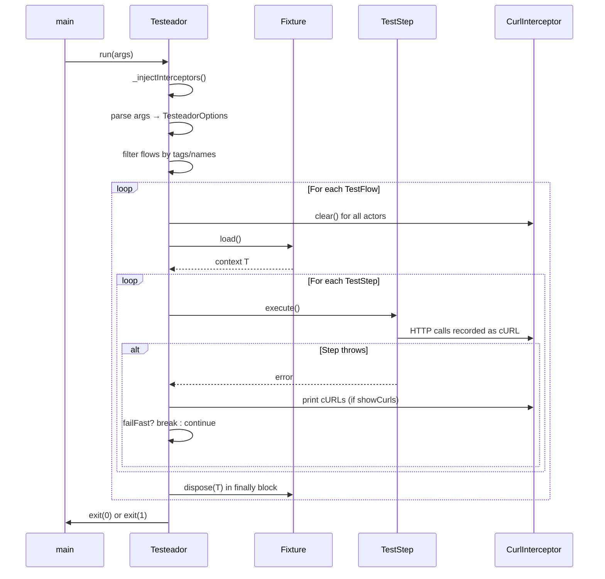
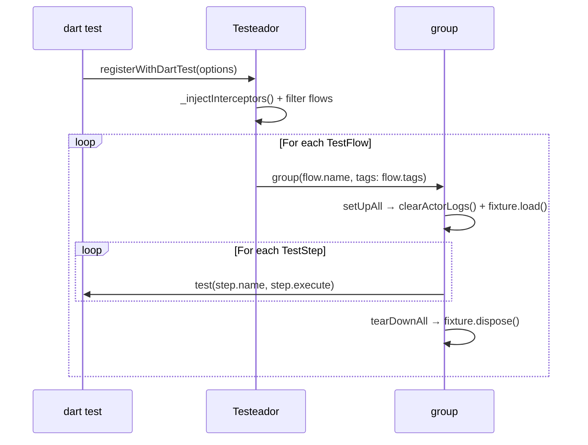

# Testeador — Architecture

> **Version:** 0.2.0 · **Dart SDK:** `^3.11.0` · **Status:** reflects actual implementation.

Full technical reference: class model, interfaces, execution flow, and glossary. Usage and quick start live in [README.md](../README.md); product context in [PRD.md](PRD.md).

## Overview

Testeador groups integration tests into sequential flows, gives each actor a `Dio` instance whose `CurlInterceptor` records every HTTP call as a cURL command, and runs steps in declaration order. On failure it prints each actor's cURL log so backend developers can reproduce the exact request sequence. It runs via `dart test` (`registerWithDartTest()`) or as a compiled standalone binary (`run(args)`). Design rationale is consolidated in [Key Design Decisions](#key-design-decisions).

## Class Hierarchy


## Fixture

A `Fixture<T>` pre-establishes resources a `TestFlow` depends on. It is generic over `T`, the context object steps capture via closure at flow-construction time.

- **`load()`** — called once before the steps run; returns `T`.
- **`dispose(T)`** — called once after all steps, pass or fail (`finally`); default no-op, so read-only fixtures need not override it.

```dart
abstract class Fixture<T> {
  const Fixture();
  Future<T> load();
  Future<void> dispose(T data) async {}
}
```

`TestFlow` holds an optional `Fixture<dynamic>`; `Testeador` calls `load()` before the steps and `dispose(data)` in a `finally` block.

## Actor

An abstract class for a user persona. Subclasses provide a `Dio` pre-configured with base URL, auth headers, and any interceptors. `Testeador` injects the `CurlInterceptor` into `actor.dio` before running, so all calls through that `Dio` are recorded.

```dart
abstract class Actor {
  Actor({
    required this.name,
    required this.dio,
    Set<String> redactHeaders = const {'authorization', 'cookie'},
  }) : curlInterceptor = CurlInterceptor(redactHeaders: redactHeaders);

  final String name;
  final Dio dio;
  final CurlInterceptor curlInterceptor;
}
```

Pass all actors to `Testeador(actors: [...])`. Before each run, `_injectInterceptors()` adds each actor's `curlInterceptor` to `dio.interceptors`; the runner clears each log before every flow and prints it on failure. Subclassing examples live in `example/pokebattle_rest/test/actors.dart`.

## TestStep

A single named action. `action` is a zero-argument async callback; actors, repositories, and shared mutable state are captured via closure at the call site — no generic `T` to thread through, so a step can capture multiple actors and repos naturally.

```dart
class TestStep {
  const TestStep({required this.name, required this.action, this.description});
  final String name;
  final String? description;
  final FutureOr<void> Function() action;
  Future<void> execute() async => action();
}
```

## TestFlow

```dart
abstract class TestFlow {
  const TestFlow({
    required this.name,
    required this.steps,
    this.fixture,
    this.tags = const {},
    this.description,
  });
  final String name;
  final String? description;
  final List<TestStep> steps;
  final Fixture<dynamic>? fixture;
  final Set<String> tags;
}
```

- **`TestFlowLasting`** — side effects intentionally persist (seeding, write-path tests).
- **`TestFlowTransient`** — ⚠️ **TODO**: marker type only; rollback is not implemented and it behaves identically to `TestFlowLasting`. Candidate strategies: a transaction-scope callback on `Fixture`, or a `RollbackStrategy` pattern. Deferred pending real-world usage.

Both share the base constructor. Each flow holds one optional `Fixture`, keeping flows self-contained and independently runnable (filtering by tag never breaks fixture dependencies). Multiple flows can share a fixture instance by reference.

## Testeador

The top-level orchestrator, with two modes (both call `_injectInterceptors()` first):

1. **`registerWithDartTest([TesteadorOptions])`** — registers flows as `group()`/`test()` blocks with `package:test`.
2. **`run(List<String> args)`** — parses CLI args, executes flows sequentially, prints to stdout/stderr, and calls `exit()`.

```dart
class Testeador {
  const Testeador({required this.flows, this.actors = const []});
  final List<TestFlow> flows;
  final List<Actor> actors;
  void registerWithDartTest([TesteadorOptions options = const TesteadorOptions()]);
  Future<void> run(List<String> args) async;
}

class TesteadorOptions {
  const TesteadorOptions({
    this.includeTags = const {},
    this.excludeTags = const {},
    this.includeFlows = const {},
    this.excludeFlows = const {},
    this.failFast = true,
    this.verbose = false,
    this.exitOnFailure = true,
    this.showCurls = true,
    this.showStackTraces = false,
  });
}
```

CLI flags (binary mode) are documented in [README.md](../README.md#cli-flags); they map one-to-one to `TesteadorOptions` fields.

### Execution flow — standalone (`run`)



### Execution flow — dart test (`registerWithDartTest`)



## CurlInterceptor

A `Dio` `Interceptor` subclass that records every outgoing request as a copy-pasteable cURL command. `onError` is not overridden — Dio forwards errors by default.

```dart
class CurlInterceptor extends Interceptor {
  CurlInterceptor({this.redactHeaders = const {'authorization', 'cookie'}});
  final Set<String> redactHeaders;
  List<String> get log => List.unmodifiable(_log);
  void clear() => _log.clear();

  @override
  void onRequest(RequestOptions options, RequestInterceptorHandler handler) {
    _log.add(_toCurl(options));
    handler.next(options);
  }
}
```

Output example:

```text
curl -X GET -H 'Content-Type: application/json' -H 'Authorization: [REDACTED]' 'https://pokeapi.co/api/v2/pokemon/charizard'
```

**Captured:** method, full URL (with query), all headers, body. **Not captured:** response bodies, timing. Headers whose lowercase name is in `redactHeaders` become `[REDACTED]` (default `{'authorization', 'cookie'}`; override per actor).

## File Structure

```text
lib/
├── testeador.dart              # public barrel — exports all public symbols
└── src/
    ├── actor.dart              # Actor
    ├── curl_interceptor.dart   # CurlInterceptor
    ├── fixture.dart            # Fixture<T>
    ├── testeador.dart          # Testeador orchestrator (CLI + dart test)
    ├── testeador_options.dart  # TesteadorOptions
    ├── test_flow.dart          # TestFlow + TestFlowLasting + TestFlowTransient
    └── test_step.dart          # TestStep

example/pokebattle_rest/
├── bin/run_tests.dart          # entry point: Testeador(...).run(args)
├── lib/data/api_client.dart    # PokeApiClient + BattleApiClient
├── lib/domain/                 # models.dart, repositories.dart
└── test/
    ├── actors.dart             # FireshActor, WatershActor + factories
    ├── fixtures/               # PokemonFixture
    └── flows/                  # fire_team_flow, water_team_flow, battle_flow
```

(`lib/src/` also contains `mcp/`, `multidev/`, `codegen/`, `discovery/`, `contract/`, and `capture/` subtrees — see [memory-bank/05-progress.md](memory-bank/05-progress.md).)

## Contract discovery from real traffic (`capture/`)

`capture/` finds *missing* contract tests by passively recording the HTTP a running app makes while it is exercised (human or AI-driven), then diffing the exercised endpoints against existing coverage and drafting the gaps. The UI is only the means; generated artifacts are pure-HTTP and carry no `capture`/`vm_service`/marionette dependency at runtime.

- **`EndpointId`** (`contract/endpoint_id.dart`) — the shared identity `(method, templatedPath, service)`; numeric/UUID/long-hex segments template to `{id}`. The *same* normalizer reduces both the exercised and the covered sets, so the diff is meaningful. Lives in `contract/` as a dependency-free leaf (both `codegen/` and `capture/` depend on it; never the reverse).
- **`CapturedExchange` + `TrafficCapture`** — the normalized request/response model and the `open`/`takeExchanges`/`close` interface. `open` enables profiling *before* the journey; capture is passive. Two backends: `CdpNetworkCapture` (web, Chrome DevTools Protocol; `CdpExchangeAssembler` holds the pure event-correlation logic) and `VmServiceHttpCapture` (native, VM-service HTTP profiler; `mapVmHttpExchange` is the pure field mapper). In-flight/missing bodies and non-HTTP channels (WebSocket/SSE) are recorded as partial/out-of-scope, never silently dropped.
- **`GapAnalysis`** — `exercised − covered`, grouped by service; one seed per endpoint (prefer the last 2xx, which also collapses `401 → refresh → retry`); cold-start (no baseline) surfaces every endpoint as a candidate with a warning flag.
- **`SecretRedactor`** — strips secrets from the *generated source* (header values + `*token*`/`*secret*`/`*password*`/`*apikey*` body fields; non-JSON bodies dropped). No literal secret ever reaches a committed test.
- **`TestUnitEmitter` + `RecordingSession`** — emit one draft `TestStep` builder per gap (testeador-only imports, `Actor` as a parameter, conservative status + key-presence assertions) and bracket the whole flow. Surface: `testeador record` (CLI) and the gated MCP tools `start_recording`/`stop_and_generate` (`TESTEADOR_MCP_ENABLE_CAPTURE=1`); both share `RecordingSession`. Coverage annotation of the codegen manifest (`coveredEndpoints`, currently always `null` → cold-start) is the baseline-population step still to be wired.

## Public API (from `lib/testeador.dart`)

| Symbol | Kind | Purpose |
| --- | --- | --- |
| `Actor` | abstract class | User persona — subclass to provide a configured Dio |
| `CurlInterceptor` | class | Dio interceptor recording HTTP calls as cURL |
| `Fixture<T>` | abstract class | Pre-flow setup + post-flow teardown |
| `TestStep` | class | A single named action within a flow |
| `TestFlow` | abstract class | Base class for flows (not instantiated directly) |
| `TestFlowLasting` | class | Flow whose side effects persist |
| `TestFlowTransient` | class | Marker type — no rollback (TODO) |
| `Testeador` | class | Orchestrator; `dart test` and CLI entry point |
| `TesteadorOptions` | class | Immutable configuration value object |

## Example Walkthrough

Two actors test a Pokémon battle system against two real backends, no mocks:

- **PokéAPI** (`https://pokeapi.co/api/v2`) — read-only Pokémon data (via `PokemonFixture`).
- **restful-api.dev** (`https://api.restful-api.dev`) — player registration and battles.

**Firesh** manages a fire team, **Watersh** a water team. Three `TestFlowLasting` flows run in sequence: `buildFireTeamFlow()` (Firesh registers and verifies her listing), `buildWaterTeamFlow()` (Watersh registers, verifies herself, confirms Firesh is visible), `buildBattleFlow()` (Firesh challenges; Watersh confirms she sees the opponent). The entry point wires them into `Testeador(flows: [...], actors: [firesh, watersh]).run(args)`.

The full source is the canonical reference — read it under [`example/pokebattle_rest/`](../example/pokebattle_rest/) (`test/actors.dart`, `test/flows/*.dart`, `bin/run_tests.dart`). Run:

```bash
dart run example/pokebattle_rest/bin/run_tests.dart --include-tags smoke --verbose
```

## Key Design Decisions

| Decision | Choice | Rationale |
| --- | --- | --- |
| Context passing to steps | Closure capture | No generic on `TestStep`; simpler API; natural Dart idiom |
| `Actor` is abstract | Subclass provides `Dio`; `Testeador` injects `CurlInterceptor` | Each system has its own auth; actor owns config, runner owns observability |
| Actor model | `Actor` holds `Dio` + `CurlInterceptor` | Independent HTTP log per actor; multi-user scenarios are first-class |
| Fixture scope | One optional `Fixture` per `TestFlow` | Self-contained flows; independent filtering; simple lifecycle |
| cURL log | Per-actor, cleared before each flow | Accurate attribution; no cross-flow noise |
| `TestFlowTransient` rollback | TODO stub | Deferred; real usage needed to pick the strategy |
| Dual execution mode | `registerWithDartTest()` + `run(args)` | Works with `dart test` AND as a compiled binary without the SDK |
| HTTP client | `Dio` | Interceptor API enables `CurlInterceptor` |
| Header redaction | Opt-out (default `authorization`, `cookie`) | Safer default for CI logs |
| No mocks | All HTTP calls to real APIs | In-memory fakes cannot catch contract regressions |

## Glossary

- **Actor** — abstract class for a user persona; subclasses provide a named `Dio` with base URL, auth, etc.
- **CurlInterceptor** — `Dio` interceptor recording outgoing requests as copy-pasteable cURL commands.
- **Fixture\<T\>** — abstract generic for setup/teardown; `load()` runs before steps, `dispose(T)` after (even on failure).
- **TestStep** — a single named action; zero-argument async callback capturing context via closure.
- **TestFlow** — abstract base for a named, ordered sequence of steps, with an optional fixture and tags.
- **TestFlowLasting** — flow whose side effects intentionally persist (seeding, write-path).
- **TestFlowTransient** — marker for read-only flows; rollback is TODO, currently behaves as Lasting.
- **Testeador** — orchestrator; runs flows sequentially via `registerWithDartTest()` or `run(args)`.
- **Contract test** — integration test validating the HTTP contract (shapes, field names, status codes) between a backend and its consumers.
- **Sequential execution** — flows and steps run one after another, in declaration order; no concurrency within a flow.
- **No mocks** — all HTTP calls go to real APIs (staging, sandbox, public); in-memory fakes are not supported.
- **Closure capture** — `TestStep.action` captures actors, repos, and shared state from the enclosing scope when the step is defined.
