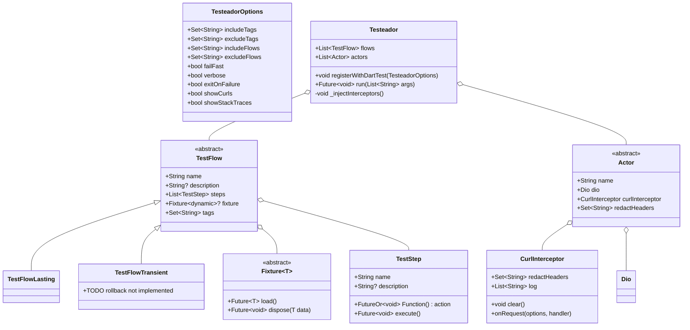
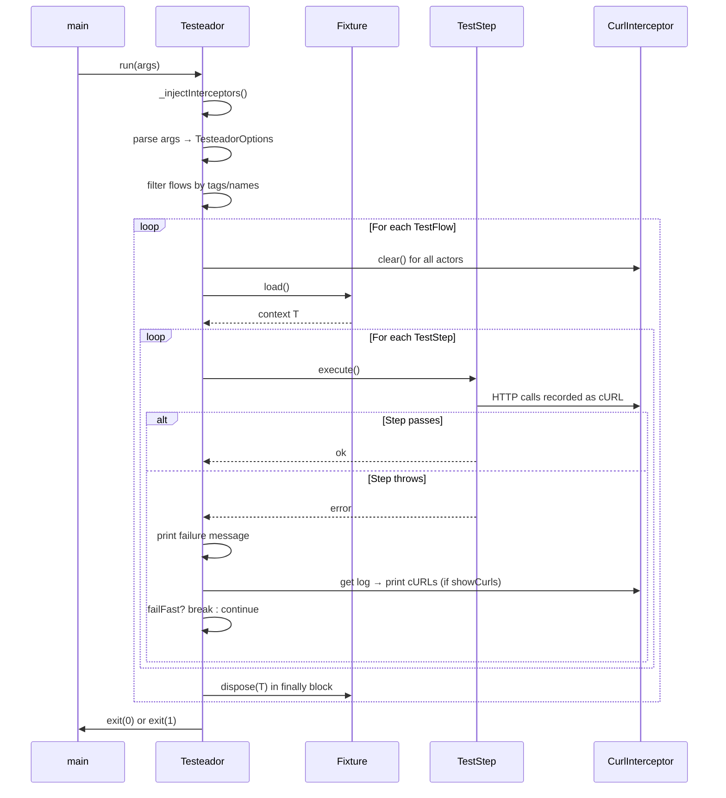
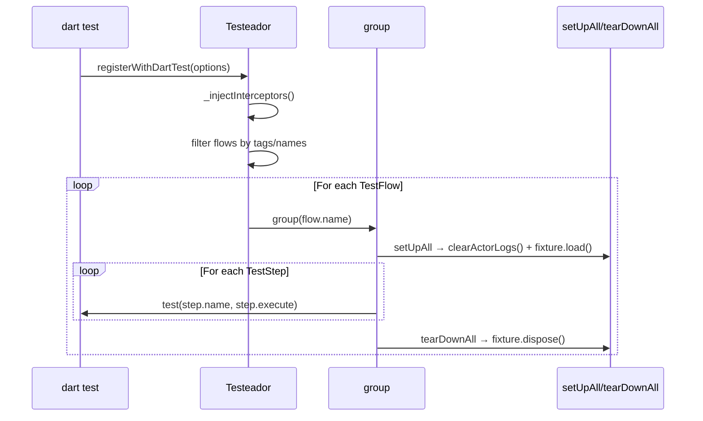

# Testeador — Architecture Document

> **Version:** 0.2.0  
> **Dart SDK:** `^3.11.0`  
> **Status:** Reflects actual implementation

---

## Table of Contents

1. [Overview](#overview)
2. [Class Hierarchy](#class-hierarchy)
3. [Fixture](#fixture)
4. [Actor](#actor)
5. [TestStep](#teststep)
6. [TestFlow](#testflow)
7. [Testeador](#testeador)
8. [Dio cURL Interceptor](#dio-curl-interceptor)
9. [File Structure](#file-structure)
10. [Public API](#public-api)
11. [Example Walkthrough — Pokémon with Firesh and Watersh](#example-walkthrough)
12. [Key Design Decisions](#key-design-decisions)

---

## Overview

**Testeador** groups integration tests into sequential flows, provides each actor with a `Dio` instance whose `CurlInterceptor` records every HTTP call as a cURL command, and ensures steps run in declaration order. On failure it prints the cURL log accumulated by each actor so backend developers can reproduce the exact request sequence. It runs either via `dart test` (using `registerWithDartTest()`) or as a compiled standalone binary (using `run(args)`).

### Core design goals

| Goal | Decision |
|---|---|
| Works with `dart test` natively | `registerWithDartTest()` registers flows as `group()`/`test()` blocks with `package:test` |
| Standalone binary for CI | `run(args)` parses CLI flags and calls `exit()`; compile with `dart compile exe` |
| HTTP observability | `Dio` + `CurlInterceptor` records every request; log is printed on failure |
| Multi-user scenarios | `Actor` encapsulates a named `Dio` instance with its own cURL log |
| Sequential execution | Steps within a flow always run in declaration order |
| No mocks | All HTTP calls must go to real APIs; in-memory fakes defeat contract testing |

---

## Class Hierarchy



---

## Fixture

### Responsibility

A `Fixture<T>` pre-establishes resources needed for a `TestFlow`. It seeds records, opens connections, or performs any setup that the flow's steps depend on. It is generic over `T` — the context object it produces. Steps capture `T` via closure at flow-construction time.

### Lifecycle

```
load() → [TestFlow steps execute] → dispose(T)
```

- **`load()`** — called once before the flow's steps run. Returns `T`.
- **`dispose(T)`** — called once after all steps complete, whether they passed or failed. Default implementation is a no-op.

### Interface

```dart
abstract class Fixture<T> {
  const Fixture();

  /// Loads and returns the context object needed by the flow's steps.
  Future<T> load();

  /// Releases resources acquired during load(). Called even on failure.
  Future<void> dispose(T data) async {}
}
```

### Design rationale

- **Generic `T`** keeps the context type-safe. Steps receive `T` directly via closure; no casting needed.
- **`dispose` has a default no-op** so read-only fixtures don't need to override it.
- **`load` returns `T`** rather than storing it internally, making the fixture stateless between runs.

### Integration with TestFlow

`TestFlow` holds an optional `Fixture<dynamic>`. `Testeador` calls `fixture.load()` before executing steps and `fixture.dispose(data)` in a `finally` block.

---

## Actor

### Responsibility

An `Actor` is an abstract class representing a user persona executing actions in a test flow. Subclasses provide the `Dio` instance pre-configured with base URL, auth headers, and any other interceptors. `Testeador` injects the `CurlInterceptor` into `actor.dio` before running, so all HTTP calls made through that `Dio` are recorded.

### Interface

```dart
abstract class Actor {
  Actor({
    required this.name,
    required this.dio,
    Set<String> redactHeaders = const {'authorization', 'cookie'},
  }) : curlInterceptor = CurlInterceptor(redactHeaders: redactHeaders);

  final String name;
  final Dio dio;
  final CurlInterceptor curlInterceptor;
}
```

### Subclassing pattern

Subclass `Actor` to define a concrete actor with its own `Dio` instance:

```dart
// example/test/actors.dart
class FireshActor extends Actor {
  FireshActor() : super(
    name: 'Firesh',
    dio: Dio(),
  );
}

class WatershActor extends Actor {
  WatershActor() : super(
    name: 'Watersh',
    dio: Dio(),
  );
}

FireshActor firesh() => FireshActor();
WatershActor watersh() => WatershActor();
```

Pass `actor.dio` to any repository or HTTP client so its calls are captured in the cURL log.

### Registration with Testeador

Pass all actors to `Testeador(actors: [...])`. Before each run, `Testeador._injectInterceptors()` adds each actor's `curlInterceptor` to their `dio.interceptors` (if not already present). The runner then clears each actor's cURL log before every flow and prints the logs on failure.

---

## TestStep

### Responsibility

A `TestStep` is a single named action within a `TestFlow`. Its `action` is a zero-argument async callback; actors, repositories, and shared mutable state are captured via closure at the call site.

### Interface

```dart
class TestStep {
  const TestStep({
    required this.name,
    required this.action,
    this.description,
  });

  final String name;
  final String? description;
  final FutureOr<void> Function() action;

  Future<void> execute() async => action();
}
```

### Why no generic `T` on `TestStep`?

Closure capture is used instead of a context parameter. This keeps the API simple — no type parameter to thread through — and lets steps capture multiple actors, repos, and shared state naturally.

---

## TestFlow

### Abstract base

```dart
abstract class TestFlow {
  const TestFlow({
    required this.name,
    required this.steps,
    this.fixture,
    this.tags = const {},
    this.description,
  });

  final String name;
  final String? description;
  final List<TestStep> steps;
  final Fixture<dynamic>? fixture;
  final Set<String> tags;
}
```

### TestFlowLasting

Side effects intentionally persist after execution. Use for seeding data, initial configurations, or write-path tests where persistence is expected and safe.

```dart
class TestFlowLasting extends TestFlow {
  const TestFlowLasting({
    required super.name,
    required super.steps,
    super.fixture,
    super.tags,
    super.description,
  });
}
```

### TestFlowTransient

> **⚠️ TODO:** Rollback is not implemented. `TestFlowTransient` is a marker type only — it behaves identically to `TestFlowLasting` at runtime. Candidate rollback approaches: (1) transaction scope callback on `Fixture`; (2) `RollbackStrategy` pattern. Decision deferred pending real-world usage data.

```dart
class TestFlowTransient extends TestFlow {
  const TestFlowTransient({
    required super.name,
    required super.steps,
    super.fixture,
    super.tags,
    super.description,
  });
}
```

### Design rationale for fixture-per-flow

Each `TestFlow` holds one optional `Fixture`. This keeps flows self-contained and independently runnable — filtering by tag does not create fixture dependency problems. Multiple flows can share the same fixture instance if needed (passed by reference).

---

## Testeador

### Responsibility

`Testeador` is the top-level orchestrator. It serves two modes:

1. **`dart test` mode** — `registerWithDartTest([TesteadorOptions])` registers all flows as `group()`/`test()` blocks with `package:test`.
2. **Standalone binary mode** — `run(List<String> args)` parses CLI arguments, executes flows sequentially, prints results to stdout/stderr, and calls `exit()`.

In both modes, `_injectInterceptors()` is called first, adding each actor's `curlInterceptor` to their `dio.interceptors` if not already present.

### Interface

```dart
class Testeador {
  const Testeador({
    required this.flows,
    this.actors = const [],
  });

  final List<TestFlow> flows;
  final List<Actor> actors;

  void registerWithDartTest([TesteadorOptions options = const TesteadorOptions()]);
  Future<void> run(List<String> args) async;
}
```

### TesteadorOptions

```dart
class TesteadorOptions {
  const TesteadorOptions({
    this.includeTags = const {},
    this.excludeTags = const {},
    this.includeFlows = const {},
    this.excludeFlows = const {},
    this.failFast = true,
    this.verbose = false,
    this.exitOnFailure = true,
    this.showCurls = true,
    this.showStackTraces = false,
  });
}
```

### CLI flags (standalone binary mode)

| Flag | Type | Default | Description |
|---|---|---|---|
| `--include-tags` | `String` (comma-separated) | — | Only run flows whose tags intersect this set |
| `--exclude-tags` | `String` (comma-separated) | — | Skip flows whose tags intersect this set |
| `--include-flows` | `String` (comma-separated) | — | Only run flows with these exact names |
| `--exclude-flows` | `String` (comma-separated) | — | Skip flows with these exact names |
| `--[no-]fail-fast` | `bool` | `true` | Stop after the first flow failure |
| `--[no-]verbose` / `-v` | `bool` | `false` | Print step names and fixture events |
| `--[no-]exit-on-failure` | `bool` | `true` | Call `exit(1)` when any flow fails |
| `--[no-]show-curls` | `bool` | `true` | Print cURL log on failure |
| `--[no-]show-stack-traces` | `bool` | `false` | Print Dart stack traces on failure |
| `--help` / `-h` | — | — | Show usage |

### Execution flow (standalone mode)



### Execution flow (dart test mode)



---

## Dio cURL Interceptor

### Responsibility

`CurlInterceptor` is a `Dio` `Interceptor` subclass that records every outgoing HTTP request as a cURL command string. On failure, `Testeador.run()` prints the accumulated log so backend developers can reproduce the exact sequence of HTTP calls.

### Interface

```dart
class CurlInterceptor extends Interceptor {
  CurlInterceptor({
    this.redactHeaders = const {'authorization', 'cookie'},
  });

  final Set<String> redactHeaders;

  List<String> get log => List.unmodifiable(_log);
  void clear() => _log.clear();

  @override
  void onRequest(RequestOptions options, RequestInterceptorHandler handler) {
    _log.add(_toCurl(options));
    handler.next(options);
  }
  // onError is NOT overridden — errors are forwarded by Dio's default behavior
}
```

### cURL generation

`_toCurl` produces a copy-pasteable cURL command:

```
curl -X GET -H 'Content-Type: application/json' -H 'Authorization: [REDACTED]' 'https://pokeapi.co/api/v2/pokemon/charizard'
```

**Captured:** HTTP method, full URL (including query parameters), all request headers, request body.  
**Not captured:** Response bodies, timing information.

### Header redaction

Headers whose lowercase name appears in `redactHeaders` are replaced with `[REDACTED]` in the log. Default set: `{'authorization', 'cookie'}`. Pass a custom set to the `Actor` subclass constructor or directly to `CurlInterceptor(redactHeaders: {...})`.

---

## File Structure

### Library (`lib/`)

```
lib/
├── testeador.dart              # Public barrel — exports all public symbols
└── src/
    ├── actor.dart              # Actor abstract class
    ├── curl_interceptor.dart   # CurlInterceptor (Dio interceptor)
    ├── fixture.dart            # Fixture<T> abstract class
    ├── testeador.dart          # Testeador orchestrator (CLI + dart test)
    ├── testeador_options.dart  # TesteadorOptions value class
    ├── test_flow.dart          # TestFlow + TestFlowLasting + TestFlowTransient
    └── test_step.dart          # TestStep class
```

### Example (`example/`)

```
example/
├── pubspec.yaml                    # depends on testeador, dio
├── bin/
│   └── run_tests.dart              # Entry point: Testeador(...).run(args)
├── lib/
│   ├── data/
│   │   └── api_client.dart         # PokeApiClient + BattleApiClient (restful-api.dev)
│   └── domain/
│       ├── models.dart             # Pokemon, Player, Battle
│       └── repositories.dart       # PokemonRepository, BattleRepository
└── test/
    ├── actors.dart                 # FireshActor, WatershActor + factory functions
    ├── fixtures/
    │   └── pokemon_fixture.dart    # PokemonFixture — pre-loads from PokéAPI
    └── flows/
        ├── fire_team_flow.dart     # Firesh registration flow
        ├── water_team_flow.dart    # Watersh registration flow
        └── battle_flow.dart        # Battle challenge flow
```

---

## Public API

### Exported from `lib/testeador.dart`

| Symbol | Kind | Purpose |
|---|---|---|
| `Actor` | `abstract class` | User persona — subclass to provide a configured Dio instance |
| `CurlInterceptor` | `class` | Dio interceptor that records HTTP calls as cURL commands |
| `Fixture<T>` | `abstract class` | Subclass to define pre-flow setup and post-flow teardown |
| `TestStep` | `class` | A single named action within a flow |
| `TestFlow` | `abstract class` | Base class for flows (not instantiated directly) |
| `TestFlowLasting` | `class` | Flow whose side effects intentionally persist |
| `TestFlowTransient` | `class` | Marker type — no rollback implemented (TODO) |
| `Testeador` | `class` | Top-level orchestrator; `dart test` and CLI entry point |
| `TesteadorOptions` | `class` | Immutable configuration value object |

---

## Example Walkthrough

### Scenario

Two actors test a Pokémon battle system against two real HTTP backends:

- **PokéAPI** (`https://pokeapi.co/api/v2`) — read-only Pokémon data (used by `PokemonFixture`).
- **restful-api.dev** (`https://api.restful-api.dev`) — player registration and battle challenges.

No mocks are used. All HTTP calls go to real APIs.

Actors:
- **Firesh** — manages a fire-type team (Charizard, Arcanine, Flareon, Rapidash, Magmar, Ninetales).
- **Watersh** — manages a water-type team (Blastoise, Vaporeon, Gyarados, Starmie, Lapras, Cloyster).

### Step 1 — Actors (`example/test/actors.dart`)

```dart
import 'package:dio/dio.dart';
import 'package:testeador/testeador.dart';

class FireshActor extends Actor {
  FireshActor() : super(name: 'Firesh', dio: Dio());
}

class WatershActor extends Actor {
  WatershActor() : super(name: 'Watersh', dio: Dio());
}

FireshActor firesh() => FireshActor();
WatershActor watersh() => WatershActor();
```

### Step 2 — Flows

Three flows run in sequence:

**`buildFireTeamFlow()`** — Firesh registers with her 6 fire Pokémon on restful-api.dev and verifies she appears in the player list.

**`buildWaterTeamFlow()`** — Watersh registers with her 6 water Pokémon, verifies her own listing, and confirms Firesh is visible.

**`buildBattleFlow()`** — Firesh selects 3 Pokémon and issues a battle challenge; Watersh views it and confirms she sees who she fights and with what Pokémon.

```dart
// example/test/flows/fire_team_flow.dart
TestFlowLasting buildFireTeamFlow() {
  final actor = firesh();
  final battleRepo = BattleRepository(actor.dio); // actor.dio captures cURLs

  final firePokemonNames = ['charizard', 'arcanine', 'flareon',
                            'rapidash', 'magmar', 'ninetales'];

  return TestFlowLasting(
    name: 'Firesh — registers fire team',
    tags: {'fire', 'registration', 'smoke'},
    steps: [
      TestStep(
        name: 'Firesh registers with her 6 fire Pokémon',
        action: () async {
          final player = await battleRepo.registerPlayer(
            actorName: actor.name,
            pokemonNames: firePokemonNames,
          );
          expect(player.name, equals('Firesh'));
          expect(player.pokemonNames, hasLength(6));
        },
      ),
      TestStep(
        name: 'Firesh can see herself in the player list',
        action: () async {
          final players = await battleRepo.listPlayers();
          expect(players.where((p) => p.name == 'Firesh'), isNotEmpty);
        },
      ),
    ],
  );
}
```

### Step 3 — Entry point (`example/bin/run_tests.dart`)

```dart
import 'package:testeador/testeador.dart';
import '../test/actors.dart';
import '../test/flows/fire_team_flow.dart';
import '../test/flows/water_team_flow.dart';
import '../test/flows/battle_flow.dart';

Future<void> main(List<String> args) async {
  final fireshActor = firesh();
  final watershActor = watersh();

  await Testeador(
    flows: [
      buildFireTeamFlow(),
      buildWaterTeamFlow(),
      buildBattleFlow(),
    ],
    actors: [fireshActor, watershActor],
  ).run(args);
}
```

Run: `dart run example/bin/run_tests.dart --include-tags smoke --verbose`

Compile: `dart compile exe example/bin/run_tests.dart -o bin/test_runner`

---

## Key Design Decisions

| Decision | Choice | Rationale |
|---|---|---|
| Context passing to steps | Closure capture | No generic type parameter on `TestStep`; simpler API; natural Dart idiom |
| `Actor` is abstract | Subclasses provide the `Dio` instance; `Testeador` injects `CurlInterceptor` | Different systems need different auth mechanisms; the actor owns its Dio configuration, `Testeador` owns the observability layer |
| Actor model | `Actor` holds `Dio` + `CurlInterceptor` | Each actor has an independent HTTP log; multi-user scenarios are first-class |
| Fixture scope | One optional `Fixture` per `TestFlow` | Self-contained flows; independent filtering; simpler lifecycle |
| cURL log | Per-actor, cleared before each flow | Accurate attribution; no cross-flow noise |
| `TestFlowTransient` rollback | TODO stub | Deferred; real-world usage needed to pick the right strategy |
| Dual execution mode | `registerWithDartTest()` + `run(args)` | Works with `dart test` AND as a compiled binary without Dart SDK |
| HTTP client | `Dio` | Interceptor API enables `CurlInterceptor`; richer request options |
| Header redaction | Opt-out (default: redact `authorization`, `cookie`) | Safer default for CI logs |
| `actors` on `Testeador` | Separate from `flows` | Actors are created outside flows in the entry point; runner manages their log lifecycle |
| No mocks | All HTTP calls go to real APIs | In-memory fakes cannot catch contract regressions; integration tests must exercise the real backend |