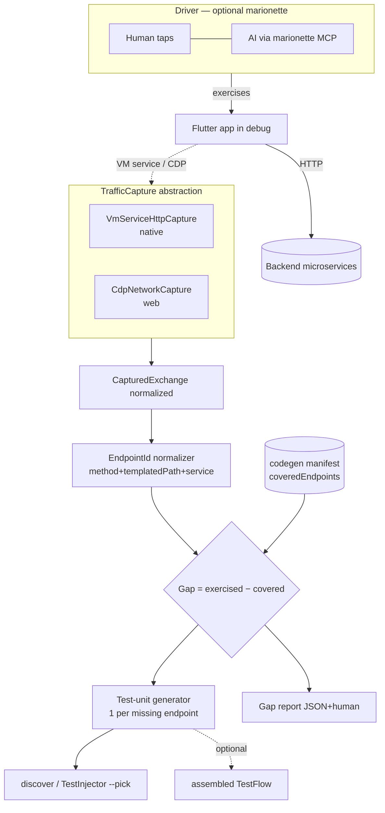

## feat: discover missing contract tests by capturing real app traffic - Extensive

> **Note:** This plan has been split into parts (after technical review). See the `-part-1`…`-part-5` files in this directory. This file is kept as the architectural overview / rationale; build from the part files.

> Brainstorm: [docs/brainstorm/2026-06-05-marionette-contract-discovery-brainstorm-doc.md](../brainstorm/2026-06-05-marionette-contract-discovery-brainstorm-doc.md)

## Overview

Add a capability that **discovers which backend contract tests are missing** by passively capturing the HTTP traffic a real Flutter app generates while it is exercised — by a human on the simulator, or by an AI driving it via [`marionette_flutter`](https://pub.dev/packages/marionette_flutter). testeador extracts the exercised endpoints, normalizes them to path templates, diffs them against the coverage recorded in the codegen manifest, and **generates one integration test unit per uncovered endpoint**, seeded with the observed request/response as the contract. Units are the default deliverable (fed into the existing `discover`/`TestInjector` `--pick` pipeline); optionally the tool assembles a full `TestFlow`.

The UI is the *means*, not the subject: testeador does not test the UI, it uses real usage to **discover the contract surface** the app depends on. The generated artifacts are pure-HTTP testeador tests that run in backend CI with no marionette or VM-service dependency — preserving the "no UI/visual/mobile testing" Non-Goal while serving the core contract-testing mission.

## Problem Statement

Writing testeador flows requires knowing which endpoints a user journey hits and which of those lack coverage. Today the author discovers this by hand (reading code, watching the network tab) — friction that works against the PRD success metric of "<30 min to a first flow" and adoption (`docs/PRD.md:77`). There is no mechanism to answer "what does the app actually call, and what of that is untested?"

Two structural facts shape the solution:

1. The app makes HTTP calls with **its own** client, so testeador's `CurlInterceptor` (which lives in testeador `Actor`s) never sees them. Capture must tap the app's traffic out-of-band.
2. The codegen manifest (`lib/src/codegen/aggregator.dart` — `FileManifest`/`DiscoveredTest`) records only `{name, groupChain, tags}` per test. **There is no endpoint-coverage field**, so "covered vs. exercised" cannot be computed today. This is the gating gap (G1).

## Proposed Solution

A driver-agnostic **bracket** workflow plus a dual-backend capture engine:

1. **`start_recording`** (MCP) / `testeador record start` (CLI) — attach to (or launch) the app and open passive HTTP capture.
2. The app is exercised by **any driver** (human taps, or AI via marionette's own MCP tools — marionette is optional and independent; it never captures HTTP).
3. **`stop_and_generate`** (MCP) / `testeador record stop` (CLI) — close capture, normalize exchanges to endpoint identities, diff against manifest coverage, and emit: (a) one integration test unit per uncovered endpoint, (b) a human + JSON gap report, (c) optionally an assembled `TestFlow`.

Two capture backends behind one `TrafficCapture` abstraction producing a single normalized `CapturedExchange`:

- **Native (Android/iOS/desktop):** Dart **VM Service HTTP profiler** (`vm_service` pkg → `getHttpProfile`/`getHttpProfileRequest`). Returns request+response headers and bodies for `dart:io`-based `dio`/`package:http`.
- **Web:** **CDP Network domain** (extends the existing pure-Dart `_Cdp` client in `lib/src/multidev/web_capture.dart`, which already calls `Network.enable`). `getResponseBody` after `loadingFinished`.

## Technical Approach

### Architecture



**Key shared primitive — `EndpointId`:** `(method, templatedPath, service)`. The *same* function normalizes both the exercised set and the covered set, or the diff is meaningless (G3). Numeric / UUID / hex path segments → `{id}`. Query params and status code are **attributes of the captured contract, not identity**.

**New code (proposed layout):**

```text
lib/src/capture/
├── captured_exchange.dart      # normalized model {method,url,reqHeaders,reqBody,status,respHeaders,respBody,host,ts,partial}
├── traffic_capture.dart        # abstract TrafficCapture { open(); drain(); close() }
├── vm_service_capture.dart     # native backend (vm_service pkg)
├── cdp_network_capture.dart    # web backend (reuse/extract _Cdp from multidev/web_capture.dart)
├── endpoint_id.dart            # EndpointId + path templating (THE shared identity fn)
├── coverage_diff.dart          # exercised − covered, grouping by service, dedup/seed rules
├── secret_redactor.dart        # redact secrets from generated SOURCE (not just logs)
├── test_unit_emitter.dart      # one integration test unit per missing endpoint
└── gap_report.dart             # JSON + human report

lib/src/mcp/tools/capture_tools.dart   # start_recording / stop_and_generate (gated, see below)
lib/src/mcp/templates/contract_unit.dart  # generated-unit template (style of contract_test.dart)
```

**Reused seams (do not reinvent):**
- Manifest read/round-trip: `lib/src/discovery/manifest_reader.dart`, `lib/src/codegen/aggregator.dart`.
- Injection / optional flow assembly: `lib/src/discovery/picker.dart`, `lib/src/discovery/flow_emitter.dart` (`emitInjectedFlow`), template `lib/src/mcp/templates/injected_flow.dart`.
- CDP client: `lib/src/multidev/web_capture.dart` (`_Cdp`, port/ws discovery).
- MCP tool pattern: `lib/src/mcp/tools/multidev_tools.dart` (`registerTool` + `okResult`/`errResult`), gating in `lib/src/mcp/tools/tools.dart:27` via env var.
- Actor/base-URL mapping: **coordinate with the keyed config (`TesteadorRuntimeConfig`) introduced in [docs/plan/2026-06-05-feat-build-suite-runners-plan.md](2026-06-05-feat-build-suite-runners-plan.md)** so both features share one base-URL/auth config model (G7).

### Manifest schema change (gating — G1)

Extend each captured test with the endpoints it covers:

```jsonc
// lib/src/_testeador/*.testeador.manifest.json
{
  "name": "registers a new trainer",
  "groupChain": ["players"],
  "tags": ["smoke"],
  "coveredEndpoints": [                       // NEW
    { "method": "POST", "path": "/players", "service": "restful-api.dev" }
  ]
}
```

How `coveredEndpoints` gets populated is **Open Decision D1** (below). Default assumption for the plan: a **capture-and-annotate pass** runs the existing suite under the same `TrafficCapture` and backfills `coveredEndpoints`. Until populated, coverage is treated as **empty + a loud cold-start warning** — never silent "all missing."

`DiscoveredTest`/`FileManifest` (`aggregator.dart`), `FileManifest.fromJson/toJson`, and `manifest_reader.dart` must round-trip the new optional field (absence = `[]`).

### Implementation Phases

> Each phase is independently mergeable. **Recommend splitting into ≥3 PRs** (Phase 1+2 capture engine; Phase 3 coverage/manifest; Phase 4+5 generation+orchestration). See "Scope warning" below.

#### Phase 1: Capture core + web backend (de-risk first)

- `CapturedExchange` model + `TrafficCapture` interface.
- `CdpNetworkCapture`: extend `_Cdp` to listen to `Network.requestWillBeSent`/`responseReceived`, call `getResponseBody` **after `loadingFinished`**; "No data found" → `partial:true`, never crash. Configure `maxTotalBufferSize`/`maxResourceBufferSize` on `Network.enable`.
- Capture-blind diagnostic: zero exchanges ⇒ explicit warning (native-adapter / WS / web-mismatch hint).
- Detect & list non-HTTP channels (WS upgrade, SSE) — excluded from generation, reported.
- **Success:** drive the existing web admin-panel example, capture its real requests+responses+bodies, assert the normalized model. Concurrency-safe buffer; deterministic seed ordering (by `EndpointId`, not arrival).
- **Effort:** M.

#### Phase 2: Native VM Service backend

- Add `vm_service` dependency. `VmServiceHttpCapture`: connect via supplied **VM service / DDS URI (attach mode default)**; `getHttpProfile`/`getHttpProfileRequest`; reconcile to `CapturedExchange`.
- Handle DDS single-client coexistence with marionette (attach to existing URI; do not steal — G11).
- Hard-warn on `native_dio_adapter`/Cronet/Cupertino bypass (zero/under-capture) — G4.
- **Success:** drive the Serverpod Flutter example, capture native dio traffic, identical normalized model to Phase 1.
- **Effort:** M/L (new infra, no prior art in repo).

#### Phase 3: Endpoint identity + coverage diff + manifest schema

- `EndpointId` + path templating; unit-tested against both exercised and covered inputs (single source of identity — G3).
- Manifest schema change + round-trip + cold-start warning (G1).
- `coverage_diff`: exercised − covered, grouped by service; dedup repeated calls (prefer **last 2xx**; collapse 401→refresh→retry to the success — G6/G9).
- Capture-and-annotate pass to backfill `coveredEndpoints` from the example suite (validates D1).
- **Success:** running the example suite then exercising the app yields a correct non-trivial gap (no false "missing" for covered endpoints).
- **Effort:** L.

#### Phase 4: Test-unit generation + secret redaction + optional flow

- `secret_redactor`: strip secrets from generated **source** — request `authorization`/`cookie` (+ configurable keys) parametrized via runtime config; response-body keys matching `token|secret|password|*_token` redacted; **no redacted literal ever emitted as an assertion** (G2 — security gate).
- `contract_unit` template + `test_unit_emitter`: one unit per missing endpoint, conservative assertions (status + top-level key presence/type), `package:testeador/testeador.dart`-only imports (runs in plain CI). Map exchange→Actor by host; missing-host ⇒ flagged Actor stub, never a compile failure (G7).
- Re-run safety: **do not overwrite** existing units by default; diff observed vs. existing contract and warn on drift; `--force` to overwrite (G8).
- Optional `--assemble-flow` via `emitInjectedFlow`.
- **Success:** generated units compile, run green against the real backend, contain no literal secrets, and feed `discover --pick`.
- **Effort:** L.

#### Phase 5: Orchestration surface (MCP bracket + CLI) + docs

- MCP `start_recording` / `stop_and_generate` (gated by a `TESTEADOR_MCP_ENABLE_*` env var, mirroring multidev gating) + equivalent `testeador record` CLI; both share the Phase 1–4 core (mirrors the dual MCP+CLI pattern of `discover`).
- Gap report (JSON artifact + human summary, grouped by microservice).
- Cleanup guaranteed on failure (kill app/Chrome, close capture — `finally` pattern from `web_capture.dart`).
- Docs: README section, `architecture.md` (new subsystem + diagram), memory-bank `04`/`05`; example walkthrough (drive example app → generate a missing test). Document marionette as the **optional** AI-driver.
- **Success:** end-to-end demo on an example; `dart analyze` clean; `very_good test` green.
- **Effort:** M.

## Alternative Approaches Considered

| Alternative | Rejected because |
|---|---|
| `MarionetteActor` (UI + contract in one flow) | Expands scope to UI testing (Non-Goal); overlaps Patrol; puts marionette in **CI runtime** (BE would need the Flutter app running); breaks sequential-HTTP determinism. |
| Proxy MCP (re-expose marionette tools) | Pure indirection over marionette's own MCP; produces no testeador artifact; serves no mission metric. |
| Record-and-replay UI journey as a flow | Goal is endpoint-coverage gaps, not UI reproduction; the journey is a disposable means. |
| Local mitmproxy-style proxy for capture | Per-platform cert/config cost; chosen VM-profiler+CDP needs neither. |
| Static analysis of existing flows for coverage baseline | Dio URLs are built at runtime; static extraction is unreliable (flagged in brainstorm). |

## Acceptance Criteria

### Functional Requirements

- [ ] One normalized `CapturedExchange` produced identically by VM-service (native) and CDP (web) backends.
- [ ] A single shared `EndpointId(method, templatedPath, service)` used for **both** exercised and covered sets; numeric/UUID segments → `{id}`.
- [ ] Manifest extended with per-test `coveredEndpoints`; reader/`fromJson`/`toJson` round-trip; absence = cold-start with explicit warning (never silent "all missing").
- [ ] Gap = exercised − covered, grouped by service; duplicates collapse (last-2xx seed); 401-retry collapses to the success.
- [ ] One integration test unit per uncovered endpoint, `testeador`-only imports, conservative assertions, mapped to an Actor by host (missing host ⇒ flagged stub).
- [ ] Generated source contains **no literal secrets** (request + response); no redacted value used as an assertion.
- [ ] Default deliverable = units fed to `discover`/`TestInjector --pick`; optional `--assemble-flow` emits a full `TestFlow`.
- [ ] MCP bracket (`start_recording`/`stop_and_generate`) + equivalent CLI share one core.
- [ ] Human + JSON gap report (per microservice).

### Non-Functional Requirements

- [ ] Capture buffer concurrency-safe; seed order deterministic (by identity, not arrival).
- [ ] Attach mode is the default when a VM-service/CDP URI is supplied; **no DDS single-client conflict** with an active marionette session.
- [ ] Generated artifacts run in CI with **no** marionette / `vm_service` dependency.
- [ ] Capture-blind (zero exchanges, native adapter, non-HTTP) reported as warnings, never "fully covered."
- [ ] Capture + child processes always cleaned up on failure.

### Quality Gates

- [ ] `dart analyze` clean; `very_good test` green; no mocks introduced (AGENTS.md).
- [ ] Unit tests for `EndpointId` templating, `coverage_diff` dedup rules, `secret_redactor`, manifest round-trip; E2E on an example app for both backends.
- [ ] README + `architecture.md` + memory-bank updated in the same PR(s).

## Success Metrics

- Time-to-first-test for a new endpoint drops from manual discovery to one record session (target: minutes).
- Zero literal secrets in any generated artifact (hard gate, automated check).
- Gap report false-positive rate (already-covered endpoints flagged "missing") ≈ 0 once `coveredEndpoints` is populated.

## Dependencies & Prerequisites

- New dep: `vm_service` (native backend only). `image`/CDP already present.
- App under test must run in **debug/profile** (VM service / CDP availability). marionette requires `MarionetteBinding.ensureInitialized()` in `kDebugMode` — **only when AI-driving**; not required for human-driven capture.
- Coordination with `feat-build-suite-runners-plan.md` for the shared keyed base-URL/auth config (`TesteadorRuntimeConfig`).

## Risk Analysis & Mitigation

| Risk | Severity | Mitigation |
|---|---|---|
| Native adapter (Cronet/Cupertino) bypasses VM profiler → silent under-capture | High | Detect zero/low capture; hard-warn with adapter hint; document `http_profile` path as future work. |
| Committing live tokens/PII in generated source | High (security) | `secret_redactor` as a gate before any codegen lands; automated no-secret check in tests. |
| Cold-start: empty `coveredEndpoints` ⇒ everything "missing" | High | Explicit cold-start warning; capture-and-annotate backfill pass; never auto-generate silently for the whole surface. |
| DDS single-client conflict with marionette | Med | Attach-mode default; share the agent's URI; never steal the connection. |
| CDP `getResponseBody` "No data found" | Med | Call within `loadingFinished`; buffer-size config; `partial:true` fallback. |
| Wrong endpoint templating corrupts diff | Med | Single shared `EndpointId`; heavy unit tests on both sides. |
| Overwrite-on-rerun masks a real contract break | Med | No-overwrite default; drift diff + warning; `--force` opt-in. |

## Future Considerations

- `http_profile`-instrumented capture for Cronet/Cupertino adapters.
- WebSocket/SSE/gRPC-web contract capture (currently detected + reported only).
- Latency assertions from captured timing (ties to roadmap).
- Auto-OpenAPI generation from the exercised surface.

## Documentation Plan

- README: new "Discover tests from real usage" section (MCP + CLI), marionette as optional AI-driver.
- `architecture.md`: new `capture/` subsystem, `EndpointId`, manifest schema change, sequence diagram.
- memory-bank `04-active-context.md` + `05-progress.md`.
- Example walkthrough using an existing example app.

## Open Decisions (resolve before/early in build)

- **D1 [CRITICAL] How `coveredEndpoints` is populated** — capture-and-annotate pass (assumed) vs. author annotation vs. build-time static (fragile). Gates the whole diff.
- **D2 [CRITICAL] `EndpointId` exact rules** — segment templating (numeric/UUID/hex?), is status/query part of identity (assumed: no). Must be locked and unit-tested.
- **D3 [CRITICAL] Secret-redaction policy for source** — which header/body keys, parametrization mechanism (reuse `redactHeaders` + runtime config).
- **D4 [IMPORTANT] Connection ownership** — attach vs. launch; coexistence with marionette/DevTools (assumed attach-default).
- **D5 [IMPORTANT] Seed-selection for repeated calls** (assumed last-2xx; 401-retry collapses).
- **D6 [IMPORTANT] Refresh behavior** (assumed no-overwrite + drift warning; `--force`).
- **D7 Actor/base-URL mapping** — share `TesteadorRuntimeConfig` with the runners plan.

## References & Research

### Internal References

- Manifest schema (extend): `lib/src/codegen/aggregator.dart:20-90`
- Manifest read/round-trip: `lib/src/discovery/manifest_reader.dart:18-78`
- Injection / flow assembly: `lib/src/discovery/picker.dart:12-186`, `lib/src/discovery/flow_emitter.dart:60-90`, `lib/src/mcp/templates/injected_flow.dart:18-42`
- CDP client to extend: `lib/src/multidev/web_capture.dart:18-211` (`Network.enable` at ~:60, `_Cdp` :174-211)
- MCP tool pattern + gating: `lib/src/mcp/tools/multidev_tools.dart:11-177`, `lib/src/mcp/tools/tools.dart:27-39`, result helpers `:11-20`
- Generated-unit style: `lib/src/mcp/templates/contract_test.dart`
- Shared config seam: `docs/plan/2026-06-05-feat-build-suite-runners-plan.md` (Component 3)

### External References

- VM Service HTTP profiler: https://pub.dev/documentation/vm_service/latest/vm_service/HttpProfileRequest-class.html · https://api.flutter.dev/flutter/vm_service/DartIOExtension.html
- marionette_flutter / marionette_mcp: https://pub.dev/packages/marionette_flutter · https://github.com/leancodepl/marionette_mcp
- CDP Network domain: https://chromedevtools.github.io/devtools-protocol/tot/Network/
- `http_profile` (future, native adapters): https://pub.dev/packages/http_profile

### Related Work

- Brainstorm: `docs/brainstorm/2026-06-05-marionette-contract-discovery-brainstorm-doc.md`
- Sibling plan (shared config): `docs/plan/2026-06-05-feat-build-suite-runners-plan.md`

## Scope warning

This plan spans a new subsystem (`capture/`), a manifest schema migration, two capture backends, codegen, and new MCP+CLI surfaces. It is **oversized for one PR**. Recommended split: **PR-A** Phase 1+2 (capture engine, both backends, no generation) · **PR-B** Phase 3 (`EndpointId`, manifest change, coverage diff) · **PR-C** Phase 4+5 (generation, redaction, orchestration, docs). Resolve D1–D3 before PR-B/PR-C.
